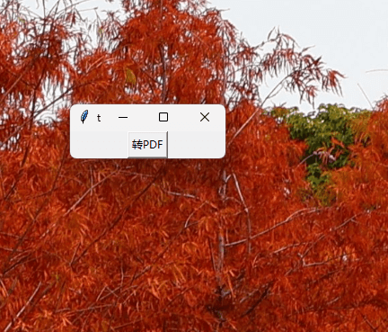

# PPT2Fig


PPT2Fig 是一个简单实用的工具，可以快速将 **当前打开的PowerPoint的当前页面** 导出为矢量PDF文件，并自动裁剪白边。非常适合在使用PPT作图时，修改PPT后快速导出PDF插入到论文中。


## 功能特点

- 一键导出当前 PPT 页面为 PDF
- 自动检测 PowerPoint 运行状态
- 自动裁剪 PDF 白边
- 智能记忆上次保存路径
- 始终置顶显示，方便操作


## 安装方法

1. 直接下载[Releases](https://github.com/OpenHUTB/ppt2pdf/releases)中的exe文件，双击即可运行

2. 如果你有python环境，可以使用pip安装

```bash
pip install ppt2fig
```
然后运行
```bash
ppt2fig
```
或者
```bash
python -m ppt2fig
```

## 使用方法
程序运行后会出现如下界面：



1. 点击"转PDF"按钮, （请确保点击时PowerPoint是打开的）
2. 选择保存位置并点击"保存", 则**当前活跃的PPT页面**会导出为PDF文件，并自动裁剪白边。(默认保存路径为当前活跃PPT文件所在目录)


## 系统要求

- Windows 操作系统
- Microsoft PowerPoint
- Python 3.8+


## 注意事项

- 使用前请确保已经打开 PowerPoint
- 确保当前 PowerPoint 中有打开的演示文稿
- 导出过程中请勿关闭 PowerPoint


## 编译指南

1. 下载源码
2. 创建一个虚拟环境，只安装本项目依赖和pyinstaller
```shell
conda env list  # 查看当前存在的虚拟环境
conda create -n ppt2pdf python=3.8
conda activate ppt2pdf
# comtypes: 用于与PowerPoint交互    
# pdfCropMargins: 裁剪PDF白边
# tkinter: python自带
pip install comtypes pdfCropMargins pyinstaller
```
3. 参考[配置upx](https://blog.csdn.net/JiuShu110/article/details/132625538)配置upx，用于压缩exe文件（可选，28.2M -> 24.5M）
4. 编译
```cmd
pyinstaller -F -w -n ppt2pdf --optimize=2 ppt2pdf/main.py  # 生成的发布文件为`dist/ppt2pdf.exe`
```

## 参考

- [pyinstaller打包瘦身](https://blog.csdn.net/JiuShu110/article/details/132625538)
- [ppt2fig](https://github.com/elliottzheng/ppt2fig)
